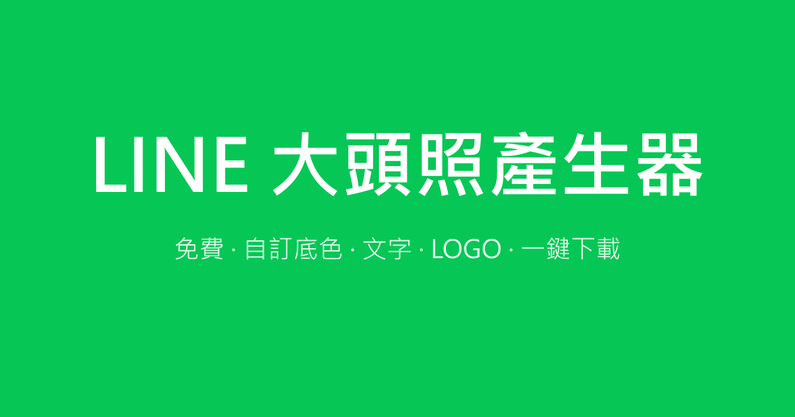

# Abby Avatar Maker 🍊

> 大頭照生產器 · 免費、好用、符合 LINE 圓形顯示規格

純前端靜態工具，自訂底色、加入文字 / Emoji / 自家 LOGO，自動縮放排版並輸出方形 PNG。
**LINE 顯示會自動裁成圓形**，下載前可即時預覽方形與圓形兩種樣貌。

## 🔗 線上 Demo

- 主網址：**https://line.abbychi.com**
- 備用網址：https://abby-line.zeabur.app（自動轉址至主網址）



## ✨ 功能特色

| 模式 | 說明 |
|---|---|
| **文字** | 手動 Enter 換行、自動二分搜尋最大字級、符合圓形範圍 |
| **Emoji** | 40+ 內建 emoji 或自由輸入，手動調大小 |
| **文字 + Emoji** | 上下排列，自動整體縮放以符合圓形 |
| **LOGO** | 上傳 PNG / JPG / SVG，支援拖曳、等比縮放、上下位移 |
| **LOGO + 文字** | LOGO 在上、文字在下，自動排版 |

**其他：**
- 尺寸：640×640（推薦）/ 480×480 / 1080×1080
- 底色：色票選色器 + HEX 輸入 + 9 種預設色 + 透明背景
- 預覽：方形 ↔ 圓形一鍵切換
- RWD：桌機、手機都能正常使用
- 零後端依賴：所有運算都在瀏覽器內完成，**上傳的 LOGO 不會離開你的裝置**

## 🏗 技術棧

- **純 HTML / CSS / JavaScript**（零框架、零編譯步驟）
- **Canvas 2D API** 繪圖與匯出
- **FileReader API** 讀取本地 LOGO 檔案
- **SVG data URI** 作為 favicon（免額外圖檔）

## 💻 本地開啟

直接雙擊 `index.html` 即可，無須任何伺服器、套件或編譯。

## 🚀 部署到 Zeabur

這是純靜態網站，任何靜態主機皆可。以 [Zeabur](https://zeabur.com) 為例：

```bash
# 安裝 CLI
npm install -g zeabur

# 登入並部署
zeabur auth login
zeabur deploy
```

Zeabur 會自動偵測為靜態網站並部署。

## 🖼 重新生成社群預覽圖

若想自訂 `og.png`，修改 `gen-og.js` 後執行：

```bash
npm install sharp --no-save
node gen-og.js
```

## 📝 授權

[MIT License](LICENSE) · 可自由使用、修改、散布

## 👤 作者

**紀澄 Abby** · [Facebook](https://www.facebook.com/chitzuling/)

如果這個小工具對你有幫助，歡迎給一顆 ⭐️ 或分享給更多人 🙌
